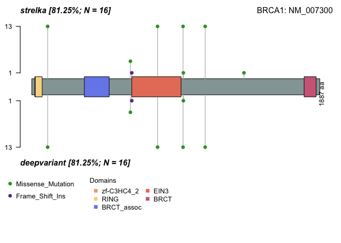
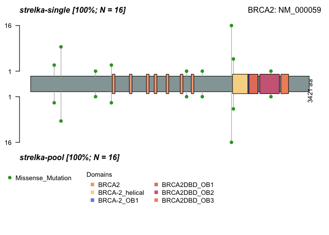

Paper_BRCA
================
Evelin Gonzalez
2024-07-26

## Figure 2

<!-- -->

**Figure 2: Summary of germline mutations found in BC patients.** This
figure presents a comprehensive summary of the mutations identified in
BC patients. It includes a bar plot categorizing the variants by
classification (silent, missense, and frameshift insertion) and type
(SNP and INS). The figure also shows the number of variants per sample,
variant type, and the nature of the genetic change. The number of
variants in each sample is d\|isplayed asx a stacked bar plot, while the
variant types are summarized in a box plot according to their
classification. Finally, we show the percentage of samples with
mutations in each gene.

## Figure 3

    ## Gene: BRCA1

<!-- -->

    ## Gene: BRCA2

<!-- -->

**Figure 3: Lollipop Plots of variants in BRCA1 and BRCA2 detected by
Strelka and DeepVariant varcallers.** Graphical representation of the
BRCA1 and BRCA2 genes, comparing the mutations obtained by Strelka and
Deepvariant. The Y-axis shows the number of patients with missense
mutations (green) and frameshift insertions (purple). The top section
represents the results from Strelka, and the bottom section represents
the results from DeepVariant of each gene. The domains are in the
labels. The results correspond to the variants obtained by both
varcallers in single mode.

## Figure 4

<!-- -->

**Figure 4: Heatmap of BRCA1/2 mutations reported in 16 breast cancer
patients using DeepVariant and Strelka, both in single and multisample
mode.** The Y-axis shows the amino acid changes (right) in single and
pooled modes (left), and the X-axis shows the 16 patients (top) across
the two varcallers used (bottom). The color indicates the potential
pathogenicity as given by the REVEL score. Variants without REVEL score
are in gray. Single-sample mode (S), Multisample mode (MS).

## Figure 5

<!-- -->

**Figure 5: Hierarchical clustering and variable contribution on
principal components.** A) Clustering of PCA dimension B) Contribution
of mutations to dimensions 1 and 2. A dashed line shown corresponds to
the expected value if the contribution were uniform. Subpopulations:
Africans (AFR), Admixed Americans (AMR), Amish (AMI), Ashkenazi Jewish
(ASJ), East Asians (EAS), South Asians (SAS), Finns (FIN), Middle
Easterners (MID), Non-Finnish Europeans (NFE), and women (XX).

## Supplementary Figure 1

<!-- -->

**Figure 1. Execution times of processes in the BRCA Nextflow
pipeline.**. This visualization shows the distribution of computation
times for each process, based on 10 independent executions using 16
sequenced breast cancer samples. The specific processes are as follows.
-ANNOVAR_DP: Annovar annotation of DeepVariant output in multisample
mode -ANNOVAR_DS: Annovar annotation of DeepVariant output in single
mode - ANNOVAR_SP: Annovar annotation of Strelka output in multisample
mode - ANNOVAR_SS: Annovar annotation of Strelka output in single mode -
B2C: BAM to CRAM conversion - BCFTOOLS_FILTER and BCF: VCF filtering -
STRELKA_POOL: Variant calling by Strelka in multisample mode -
STRELKA_ONESAMPLE: Variant calling by Strelka in single mode -
DEEPVARIANT_ONESAMPLE: Variant calling by DeepVariant in single mode -
GLNEXUS_DEEPVARIANT: Variant calling by DeepVariant in multisample mode.

## Supplementary Figure 3

<!-- -->

**Figure 3: Coverage by position on target regions of BRCA1/2 genes.**
The x-axis represents the genomic coordinates, and the y-axis represents
the coverage in logarithmic scale at each on-target position. Each line
represents the coverage obtained for patients sequenced. (A) Coverage by
position in the BRCA2 gene. (B) Coverage by position in the BRCA1 gene.

## Supplementary Figure 4

    ## Gene: BRCA1

<!-- -->

    ## Gene: BRCA2

<!-- -->

**Figure 4: Comparison of the nonsynonymous variants reported by the
Strelka varcaller in single and multisample modes.** SNVs and INDELs
reported for the 16 patients in the BRCA1 and BRCA2 genes. The Y-axis
shows the number of patients with the mutation, and the X-axis shows the
amino acids and domains of each gene.

## Supplementary Figure 5

    ## Gene: BRCA1

<!-- -->

    ## Gene: BRCA2

<!-- -->

**Figure 5: Comparison of the nonsynonymous variants reported by the
DeepVariant varcaller in single and multisample modes.** SNVs and INDELs
reported for the 16 patients in the BRCA1 and BRCA2 genes. The Y-axis
shows the number of patients with the mutation, and the X-axis shows the
amino acids and domains of each gen

## Supplementary Figure 7

<!-- -->

**Figure 7: Principal Component Analysis (PCA) of allele frequency
variants in breast cancer patients.** a) PCA plot showing dimensions 1
and 2. b) Percentage of variance explained by each dimension. c)
Clustering of populations.
